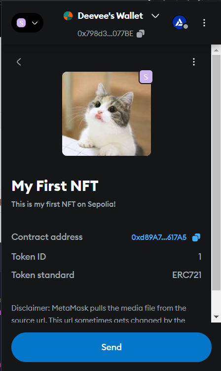

# MyNFT - Deploy and Mint Your Own NFTs

This project allows you to deploy an ERC-721 NFT smart contract on the Ethereum blockchain and mint NFTs with metadata stored on IPFS.

## Prerequisites

Make sure you have the following installed:
- **Node.js** (Latest LTS recommended)
- **npm or yarn** (Comes with Node.js)
- **Hardhat** (Ethereum development framework)
- **MetaMask** (For interacting with your NFT on the blockchain)


## Clone the Repository

```sh
git clone https://github.com/deevee47/deploying-nft.git
cd deploying-nft
```

## Install Dependencies

```sh
npm install --force
```

## Configure Hardhat

1. Create a **.env** file in the root directory and add your **Sepolia network** RPC URL and private key,  get the API URL from Alchemy:

   ```sh
   API_URL="https://sepolia.infura.io/v3/YOUR_INFURA_PROJECT_ID"
   PRIVATE_KEY="YOUR_WALLET_PRIVATE_KEY"
   ```


   ```js
   require("dotenv").config();
   require("@nomicfoundation/hardhat-toolbox");

   module.exports = {
     solidity: "0.8.20",
     networks: {
       sepolia: {
         url: process.env.INFURA_API_URL,
         accounts: [process.env.PRIVATE_KEY],
       },
     },
   };
   ```

## Deploy the Smart Contract

1. Compile the contract:
   ```sh
   npx hardhat compile
   ```

2. Deploy the contract to the Sepolia testnet:
   ```sh
   npx hardhat run scripts/deploy.js --network sepolia
   ```

   **Output Example:**
   ```sh
   Deploying contract with address: 0xYourDeployerAddress
   Contract deployed to: 0xYourContractAddress
   Minting NFT...
   Minted NFT with Token ID: 1
   ```

## Mint an NFT

Update `scripts/deploy.js` with your recipient address and IPFS link:

```js
const recipient = "0xYourWalletAddress";
const tokenURI = "ipfs://your-token-uri";
```

Then run:
```sh
npx hardhat run scripts/deploy.js --network sepolia
```

## View NFT on MetaMask

1. Open MetaMask.
2. Go to **Assets > Import Tokens**.
3. Enter **Contract Address** and **Token ID**.
4. Click **Import** to see your NFT!

## Adding an Image to the NFT

1. Upload your image to **IPFS** using a service like [Pinata](https://www.pinata.cloud/).
2. Get the **IPFS URL** (e.g., `ipfs://your-image-hash`).
3. Include it in the `tokenURI` JSON:
   ```json
   {
     "name": "My NFT",
     "description": "This is my first NFT!",
     "image": "ipfs://your-image-hash"
   }
   ```
4. Upload this JSON file to IPFS and use the generated link as the `tokenURI`.

---

Congratulations! You have successfully deployed and minted your own NFT. 🚀

